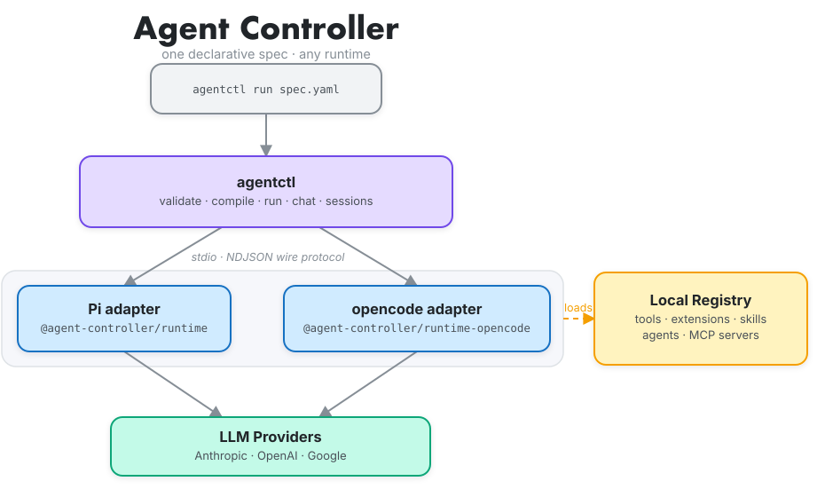

# Agent Controller

> **Declarative runtime for AI agents.** Define agents in YAML (ADL — Agent Definition Language). Run the same spec on the Pi, opencode, codex, or claude runtime through a consistent backend interface.

Agent Controller separates **agent intent** (model, persona, tools, skills, MCP servers, guardrails, observability) from **execution substrate**. A spec that sticks to the cross-adapter feature set (persona, skills, MCP servers, guardrails) runs on the Pi, opencode, codex, or claude adapter by changing one field — `runtime.type`. Specs that use Pi-only capabilities (custom Pi-extension tools like `get_time`, `spec.extensions[]`, subagents) are Pi-only — opencode and codex reject them at startup. The codex adapter additionally requires `model.provider: openai` (anthropic and google are rejected). Remote backends, like the Kubernetes target (a schema-level skeleton today), attach via a `RuntimeBinding`. Full [capability matrix](docs/architecture/harness-matrix.md).

```bash
agentctl run  examples/hello.yaml           # Pi adapter
agentctl run  examples/hello-opencode.yaml  # opencode adapter (needs the `opencode` CLI on PATH)
agentctl run  examples/hello-codex.yaml     # codex adapter (needs the `codex` CLI on PATH + OPENAI_API_KEY)
agentctl run  examples/hello-claude.yaml    # Claude Agent SDK adapter (needs ANTHROPIC_API_KEY)
agentctl chat examples/hello.yaml           # interactive REPL with session persistence
```

## Architecture

<p align="center">
  
</p>

`agentctl` (a Go binary) compiles the ADL spec and dispatches it over a versioned stdio NDJSON wire protocol to a runtime adapter (Pi, opencode, codex, or claude). The adapter loads the local registry — tools, extensions, skills, agents, MCP servers — and drives the session against the model provider. Backends beyond Local (Kubernetes skeleton, AgentCore) are reserved in the schema but not fully wired. See [`docs/architecture/overview.md`](docs/architecture/overview.md) for the full layer breakdown and wire protocol reference.

## Quick start

### Recommended (pre-built binary + npm)

```bash
# 1. Download agentctl from the latest GitHub release and put it on PATH
#    or: go install github.com/CCDevelopForFun/agent-controller/cli/cmd/agentctl@v0.7.0

# 2. Install the runtime adapter you need
npm install -g @agent-controller/runtime              # Pi  (runtime.type: local)
npm install -g @agent-controller/runtime-opencode     # opencode (runtime.type: local-opencode)
npm install -g @agent-controller/runtime-codex        # codex (runtime.type: local-codex)
npm install -g @agent-controller/runtime-claude       # claude (runtime.type: local-claude)
#   the opencode adapter also needs the separate `opencode` CLI on PATH:  npm install -g opencode-ai
#   the codex adapter also needs the `codex` CLI on PATH and OPENAI_API_KEY set in the environment
#   the claude adapter needs no separate CLI — just ANTHROPIC_API_KEY set in the environment

# 3. Write a self-contained spec (no registry refs, so it runs from any dir)
cat > /tmp/hello.yaml <<'EOF'
apiVersion: agent-controller.dev/v1alpha1
kind: Agent
metadata: { name: hello }
spec:
  model: { provider: anthropic, name: claude-sonnet-4-20250514 }
  persona: { role: Helpful demo, instructions: Answer concisely. }
  task: Say hello.
  tools: []
  runtime: { type: local }
EOF

# 4. Set your API key and run
export ANTHROPIC_API_KEY=sk-ant-...
AGENT_CONTROLLER_RUNTIME="$(npm root -g)/@agent-controller/runtime/dist/index.js" \
  agentctl run /tmp/hello.yaml
```

### Source clone

```bash
(cd runtime && npm install --ignore-scripts && npm run build)
(cd runtime-opencode && npm install --ignore-scripts && npm run build)
(cd cli && go build -o bin/agentctl ./cmd/agentctl)

export ANTHROPIC_API_KEY=sk-ant-...
./cli/bin/agentctl run examples/hello.yaml
```

> **Run from the repo root.** The adapter path and manifest registry (`tools/`, `extensions/`, `skills/`, `agents/`) resolve relative to cwd. Set `AGENT_CONTROLLER_RUNTIME` to override the adapter path.

## Commands

```bash
agentctl validate  spec.yaml                          # check ADL against JSON Schema
agentctl compile   spec.yaml                          # print resolved CompiledSpec JSON
agentctl run       spec.yaml                          # run agent, stream NDJSON events
agentctl run       spec.yaml --task "override"        # override spec.task at runtime
agentctl run       spec.yaml --resume <session-id>    # resume a prior session (Pi + opencode + codex)
agentctl run       spec.yaml --binding binding.yaml   # resolve against a RuntimeBinding
agentctl chat      spec.yaml                          # interactive REPL (v0.6)
agentctl sessions  list                               # list persisted sessions
agentctl sessions  sweep --ttl 168h                   # retire idle sessions
agentctl install   npm:<pkg>                          # install a Pi package/extension (shells to `pi install`)

# v0.7 — scheduler-task surface (parameterize input, capture output, share memory)
agentctl run       spec.yaml --input text="hello"     # ${inputs.text} interpolation in spec.task
agentctl run       spec.yaml --input text=@prev.txt   # read an input value from a file (handoff)
agentctl run       spec.yaml --output-file out.json   # capture result; validated by spec.outputSchema
agentctl run       spec.yaml --workspace ./run-42     # durable memory shared across steps
```

## Serving agents over HTTP

`agentctl serve` (v0.8) wraps any ADL agent spec in a long-lived HTTP/SSE server so external clients — schedulers, UIs, integration tests — can open sessions and exchange turns without spawning a new process per request.

```bash
agentctl serve examples/hello.yaml --port 8080
```

### Flags

| Flag | Default | Description |
|---|---|---|
| `--port` | `8080` | TCP port to listen on |
| `--in-memory` | off | Use an in-memory session store instead of SQLite |
| `--max-concurrent-turns` | `8` | Max in-flight turns before returning 429 |
| `--max-sessions` | `1000` | Max active sessions before create returns 429 |
| `--session-ttl` | `168h` | Idle session TTL swept in the background |
| `--shutdown-grace` | `25s` | Max time to drain in-flight turns on SIGTERM |

### Endpoints

| Method | Path | Description |
|---|---|---|
| `GET` | `/healthz` | Liveness probe — always 200 |
| `GET` | `/readyz` | Readiness probe — 200 until draining, then 503 |
| `POST` | `/v1/sessions` | Create a session; body is optional — omit entirely, send `{}`, or send `{"inputs":{...}}` for interpolation values; returns 201 `{id,agentName,runtimeType,status,createdAt}` |
| `GET` | `/v1/sessions` | List sessions (all statuses); add `?status=active` to filter to active only |
| `GET` | `/v1/sessions/{id}` | Get a single session |
| `DELETE` | `/v1/sessions/{id}` | Delete a session (204) |
| `POST` | `/v1/sessions/{id}/turns` | Run a turn; body `{"input":"..."}` ; streams `text/event-stream` SSE |

**Error codes:** 409 (session busy), 429 (global turn cap or max-sessions), 503 (draining).

**SSE frame format:** each frame is `event: <type>\ndata: <json>\n\n`; the stream ends on a `session.ended` frame.

### Example

```bash
# 1. Start the server
agentctl serve examples/hello.yaml --port 8080 &

# 2. Create a session
SESSION=$(curl -s -X POST http://localhost:8080/v1/sessions \
  -H 'Content-Type: application/json' \
  -d '{}' | python3 -c "import sys,json; print(json.load(sys.stdin)['id'])")

# 3. Run a turn and stream SSE events
curl -N -X POST "http://localhost:8080/v1/sessions/${SESSION}/turns" \
  -H 'Content-Type: application/json' \
  -d '{"input":"Hello!"}' \
  --no-buffer
```

A complete runnable example is at [`examples/serve-client.sh`](examples/serve-client.sh).

> **Metrics and auth** (OIDC / API-key middleware) are deferred to v0.8.x. TLS is expected to be terminated by a sidecar or load-balancer proxy.

## What ADL can declare

| Field | Since | What it is |
|---|---|---|
| `model` | v0.0.1 | Provider + model name (Anthropic / OpenAI / Google) and optional temperature |
| `persona` | v0.0.1 | `role` + `instructions` — prepended to the system prompt |
| `task` | v0.0.1 | Initial user prompt that drives the session — supports `${inputs.<key>}` interpolation from `--input` (v0.7) |
| `outputSchema` | v0.7 | JSON Schema — with `--output-file`, the agent's reply is parsed as JSON, validated, and written |
| `tools` | v0.0.1 | Tool allowlist — local registry names or Pi built-ins (`bash`, `read`, `edit`, `write`) |
| `extensions` | v0.0.1 | Pi extension allowlist — local registry or `source: npm:<pkg>` for auto-install |
| `skills` | v0.1.2 | Markdown skill files — bodies inlined into the system prompt at session start |
| `subagents` | v0.1.3 | Child agents the parent can delegate to |
| `mcpServers` | v0.1.5 | MCP servers (stdio / streamable-http / SSE) |
| `guardrails` | v0.1.8 | Hallucination detector mode (`block` / `warn` / `correct`) |
| `observability.tracing` | v0.5 | Emit OTel spans to an OTLP endpoint |
| `runtime` | v0.0.1 | `type` (`local-pi` / `local-opencode` / `local-codex` / `local-claude`; `local` is the legacy Pi alias) + optional `requirements` for capability matching |

The full schema is at [`schemas/adl.v1alpha1.json`](schemas/adl.v1alpha1.json). Unknown fields are rejected at compile time.

## Skills

Skill bodies are inlined into the system prompt at session start — no lazy loading. Declare them by name; the runtime reads `skills/<name>/SKILL.md` and appends the body.

```yaml
spec:
  skills:
    - name: example-time-skill   # formats all timestamps as ISO-8601 UTC
    - name: using-superpowers    # teaches the agent how to find and use skills
  tools:
    - name: bash                 # required if a skill prescribes shell commands
```

Vendoring an external skill is a file copy: `cp SKILL.md skills/<slug>/SKILL.md`.

See [`examples/claude-skills-with-bash.yaml`](examples/claude-skills-with-bash.yaml) and [`examples/claude-skills-demo.yaml`](examples/claude-skills-demo.yaml).

## MCP servers

MCP-registered tools surface to the model as `mcp_<server>_<tool>`. The runtime writes `.pi/mcp.json` at session start and loads the MCP extension automatically.

```yaml
spec:
  mcpServers:
    - name: time-server
      transport: stdio
      command: npx
      args: ["-y", "@modelcontextprotocol/server-time"]
      lifecycle: eager   # connect at session start; default is lazy
```

Supported transports: `stdio`, `streamable-http`, `sse`. See [`examples/mcp-time.yaml`](examples/mcp-time.yaml) and [`examples/self-contained-mcp.yaml`](examples/self-contained-mcp.yaml).

## Chat & sessions

`agentctl chat` opens an interactive REPL on any adapter (`runtime.type: local` / `local-pi` / `local-opencode` / `local-codex`). Sessions persist across process restarts via SQLite; pick up where you left off with `--resume`.

```bash
agentctl chat examples/hello.yaml               # start a session
agentctl chat examples/hello.yaml --resume <id> # resume a specific session
agentctl sessions sweep --ttl 168h              # expire sessions idle longer than 7d
```

Each session keeps full turn history, so a resumed chat continues exactly where it left off. The SQLite store lives at `$XDG_DATA_HOME/agent-controller/sessions.db` (default `~/.local/share/agent-controller/sessions.db`).

## OTel tracing

`agentctl run` emits one `agentctl.run` root span; `agentctl chat` emits one `agentctl.run` root span for the whole REPL with a `chat.turn` span per turn. Adapter spans (LLM calls, tool calls) nest underneath. Point the exporter at any OTLP-compatible backend:

```bash
OTEL_EXPORTER_OTLP_ENDPOINT=http://localhost:4318 \
  agentctl run examples/tracing-demo.yaml
```

Enable tracing in the spec:

```yaml
spec:
  observability:
    tracing: true
```

Works with Jaeger, Grafana Tempo, Honeycomb, BrainTrust, and any OTLP receiver. See [`examples/tracing-demo.yaml`](examples/tracing-demo.yaml).

## Guardrails

Three layers defend against the model writing fake tool-call XML in its response:

1. **Honesty preamble** — system-prompt block telling the model real tool calls go through the runtime's tool channel.
2. **Skill body framing** — each inlined skill body is wrapped with a runtime override.
3. **XML detector** — scans every assistant message; behavior is configurable.

```yaml
spec:
  guardrails:
    hallucinationDetector: warn   # block (default) | warn | correct
```

- `block` — emits an error event and exits non-zero.
- `warn` — scrubs the fabricated XML and lets the session complete.
- `correct` — same as `warn`, plus one corrective re-prompt.

See [`examples/guardrails-block.yaml`](examples/guardrails-block.yaml), [`guardrails-warn.yaml`](examples/guardrails-warn.yaml), [`guardrails-correct.yaml`](examples/guardrails-correct.yaml).

## RuntimeBinding

`RuntimeBinding` maps an agent spec to a concrete execution target. At run time the CLI matches the spec's `runtime.requirements` against the target's advertised capabilities — unmet requirements emit a warning and the run proceeds, unless the binding sets `target.strict: true`, which promotes them to a hard error before the session starts.

```bash
agentctl run spec.yaml --binding examples/bindings/local-default.yaml
```

```yaml
apiVersion: agent-controller.dev/v1alpha1
kind: RuntimeBinding
metadata: { name: local-default }
spec:
  selector:
    runtimeType: local-pi
    capabilities: { streaming: true, sandbox: false }
  target:
    type: local
```

See [`examples/bindings/`](examples/bindings/) for ready-to-use specs. Full capability table: [`docs/architecture/harness-matrix.md`](docs/architecture/harness-matrix.md).

## Scheduler tasks (DAGs of agents)

Since v0.7, `agentctl run` is a **per-step task primitive**: an external scheduler (Maestro, Airflow, Temporal) owns the DAG, and agent-controller runs one agent per step. There's no workflow YAML and no in-process engine — just the three things a step needs to compose.

```bash
agentctl run classifier.yaml --input text="great product"        # 1. parameterize:  ${inputs.text} → spec.task
agentctl run classifier.yaml --input text=@/shared/prev.json     #    file handoff:   value read from a prior step
agentctl run classifier.yaml --output-file /shared/result.json   # 2. capture:       result written on a clean run
agentctl run classifier.yaml --workspace ./run-42                # 3. share memory:  durable state across steps
```

`spec.outputSchema` validates the reply as JSON before it's written, and `--workspace` exposes memory tools over MCP — so the same flags work on both adapters. Copy-paste configs for Maestro, Airflow, and Temporal live in [`examples/schedulers/`](examples/schedulers/).

## Examples

| File | What it demos |
|---|---|
| `examples/hello.yaml` | Basic agent — `get_time` tool, `audit-log` extension, `example-time-skill` |
| `examples/hello-opencode.yaml` | Same shape on the opencode adapter (`runtime.type: local-opencode`) |
| `examples/hello-codex.yaml` | Minimal agent on the codex adapter (`runtime.type: local-codex`, `model.provider: openai`) |
| `examples/tracing-demo.yaml` | OTel tracing — run with `OTEL_EXPORTER_OTLP_ENDPOINT=...` |
| `examples/mcp-time.yaml` | MCP via `@modelcontextprotocol/server-time` |
| `examples/self-contained-mcp.yaml` | Same MCP agent with `extensions[].source` auto-install |
| `examples/claude-skills-with-bash.yaml` | A skill + `bash` tool (agent runs a real shell command) |
| `examples/claude-skills-demo.yaml` | External skills inlined into the prompt (no tools) |
| `examples/subagent-demo.yaml` | Parent agent delegates to a `sql-explorer` child |
| `examples/bash-allowlist.yaml` | Bash command allowlist via `@gotgenes/pi-permission-system` |
| `examples/guardrails-{block,warn,correct}.yaml` | Hallucination detector modes side-by-side |
| `examples/bindings/` | RuntimeBinding specs — local Pi (`local-default`, `local-strict`) + Kubernetes (`kubernetes-kind`) |
| `examples/schedulers/` | `agentctl run` as a Maestro / Airflow / Temporal task — shared `text-classifier.yaml` + per-scheduler config |

## Repo layout

| Directory | Purpose |
|---|---|
| `cli/` | Go binary `agentctl`. See [`cli/README.md`](cli/README.md). |
| `runtime/` | Pi adapter (Node). See [`runtime/README.md`](runtime/README.md). |
| `runtime-opencode/` | opencode adapter (Node). See [`runtime-opencode/README.md`](runtime-opencode/README.md). |
| `runtime-codex/` | codex adapter (Node). Requires `codex` CLI on PATH + `OPENAI_API_KEY`. See [`runtime-codex/README.md`](runtime-codex/README.md). |
| `schemas/` | JSON Schemas (ADL v1alpha1 + manifest v1). See [`schemas/README.md`](schemas/README.md). |
| `tools/` | Built-in tools (`get_time`) |
| `extensions/` | Built-in Pi extensions (`audit-log`, `subagent`) |
| `skills/` | Built-in / vendored skills (`example-time-skill`, `using-superpowers`) |
| `agents/` | Subagent persona files (`sql-explorer.md`) |
| `examples/` | Example ADL files |
| `e2e/` | End-to-end test harness — supports `ADAPTER=pi\|opencode\|codex` |
| `docs/architecture/` | Architecture diagrams and reference |

## Status

`v0.7.0` — developer preview.

| Tag | What landed |
|---|---|
| `v0.1.x` | ADL + Pi adapter + full original feature surface (tools, extensions, skills, subagents, MCP, guardrails) |
| `v0.2.0` | opencode adapter, multi-adapter abstraction, harness capability matrix |
| `v0.3.x` | RuntimeBinding, capability matcher, self-contained npm install |
| `v0.4.0` | First remote backend — Kubernetes Pod skeleton |
| `v0.5.x` | End-to-end OTel tracing (root span → adapter spans → tool spans) |
| `v0.6.0` | `agentctl chat` REPL, SQLite session store, per-turn OTel spans *(folded into v0.7.0 — never tagged standalone)* |
| `v0.7.0` | `agentctl run` as a scheduler task — `--input`/`${inputs}`, `--output-file`/`outputSchema`, file handoff, `--workspace` durable memory |

<details>
<summary>v0.1.x release history</summary>

| Tag | What landed |
|---|---|
| `v0.0.1-mvp` | ADL + local runner + Pi adapter + `get_time` + `audit-log` |
| `v0.1.0` | `agentctl install` |
| `v0.1.1` | Session resumption (`--resume`, `sessions list`) |
| `v0.1.2` | Skill kind |
| `v0.1.3` | Subagent kind |
| `v0.1.4` | `install extension <name>` alias |
| `v0.1.5` | MCPServer kind |
| `v0.1.6` | Self-contained extensions (`spec.extensions[].source`) |
| `v0.1.7` | Skill bodies active by default |
| `v0.1.8` | Hallucination guardrails |
| `v0.1.9` | Pi built-in tools (`bash`/`read`/`edit`/`write`) in ADL |
| `v0.1.10` | `spec.guardrails.hallucinationDetector` modes (`warn`/`block`/`correct`) |

</details>

For next steps, see [`ROADMAP.md`](ROADMAP.md). For the full per-feature capability table, see [`docs/architecture/harness-matrix.md`](docs/architecture/harness-matrix.md).

## Contributing

See [`CONTRIBUTING.md`](CONTRIBUTING.md) for the dev setup and slice-by-slice workflow. Security issues: [`SECURITY.md`](SECURITY.md).

## License

MIT.
