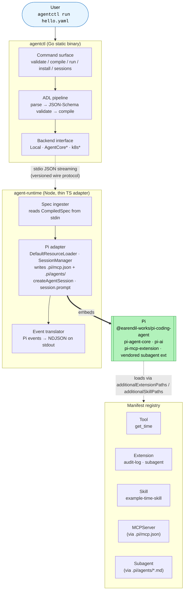
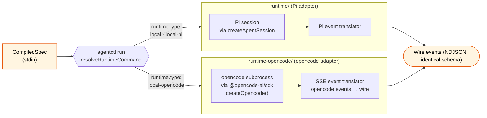
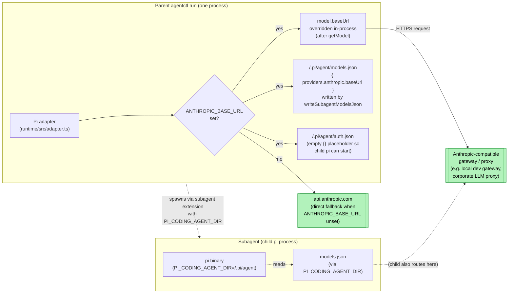

# Architecture Overview



\*Components marked with an asterisk are reserved in the schema but not loaded at v0.1. Live components (Tool, Extension, Skill, MCPServer, Subagent) all ship as of v0.1.3.

## v0.1 feature summary

| Version | What landed | Pi mechanism |
|---|---|---|
| `v0.1.0` | `agentctl install` verb — delegates to `pi install npm:<name>` | Pi's package system (`pi.manifest` block) |
| `v0.1.1` | Session resumption — `--resume <id>` + `agentctl sessions list` | Pi's file-backed `SessionManager.continueRecent` |
| `v0.1.2` | `Skill` kind — ADL `spec.skills[]` | `DefaultResourceLoader.additionalSkillPaths` |
| `v0.1.3` | `Subagent` kind — hierarchical multi-agent | Vendored Pi subagent extension; `.pi/agents/*.md` |
| `v0.1.4` | `extension`/`plugin` install alias + docs | (same as v0.1.0, syntactic sugar) |
| `v0.1.5` | `MCPServer` kind — ADL `spec.mcpServers[]` | `pi-mcp-extension` npm package; `.pi/mcp.json` |
| `v0.1.6` | Self-contained YAML — `spec.extensions[].source` auto-installs via Pi | `resolveSourceBoundExtension` in adapter; `pi install npm:<name>` |

## v0.2 multi-adapter architecture

v0.2 generalizes the runtime from "the Pi adapter" to a small family of swappable adapters that all consume the same `CompiledSpec` and emit the same wire-event stream. ADL stays portable; the CLI dispatches to whichever adapter the spec's `runtime.type` selects.



| Version | What landed | Adapter mechanism |
|---|---|---|
| `v0.1.10` | Hallucination guardrails (`block`/`warn`/`correct`) | Pi adapter: honesty.ts — preamble, scrubber, corrective re-prompt |
| `v0.2 slice 2.1` | opencode adapter skeleton + CLI dispatch | `runtime-opencode/` package + `resolveRuntimeCommand` |
| `v0.2 slice 2.2` | opencode config mapper | `buildOpencodeConfig`: persona/tools/permissions/temperature → cfg.agent[primary] |
| `v0.2 slice 2.3` | `@opencode-ai/sdk` dependency + smoke tests | createOpencode() smoke-test that doesn't require a real model |
| `v0.2 slice 2.4` | Full session dispatch + SSE event translation | session.promptAsync + producer-consumer queue + event-translator.ts |
| `v0.2 slice 2.5` | MCP + subagents + skills wiring | cfg.mcp + cfg.agent[subagent] with mode="subagent" + inlined skill bodies |
| `v0.2 slice 2.6` | Harness matrix fill + dual-adapter E2E + docs | This commit; matrix at `docs/architecture/harness-matrix.md` |

### When to pick which adapter

| Need | Use | Why |
|---|---|---|
| Pi-format extensions (audit-log, custom tools) | Pi adapter (`local` / `local-pi`) | Pi extension modules don't run inside opencode |
| Session resume (`--resume`) | Pi adapter | opencode resume not yet wired |
| `bash` allowlist via tool config | Pi adapter (v0.1.11+) | opencode rejects per-tool config |
| MCP + built-in tools coexisting in the same spec | opencode adapter | Pi adapter currently deactivates built-ins when MCP is non-empty |
| Native opencode MCP / subagent support without Pi indirection | opencode adapter | Native cfg.mcp + cfg.agent[subagent] |
| Cancellation event (`reason: cancelled`) on SIGINT | opencode adapter | Pi adapter currently surfaces SIGINT as `error` |

See [harness-matrix.md](./harness-matrix.md) for the per-feature support table.

## Layer responsibilities

| Layer | Owns | Doesn't own |
|---|---|---|
| `agentctl` (Go) | YAML parsing, schema validation, manifest resolution, CompiledSpec compilation, subprocess management, signal handling, pretty-printing, exit codes, **adapter dispatch** | LLM calls, tool execution, adapter internals |
| `runtime/` (Pi adapter) | Pi session lifecycle, resource loader construction, event translation to wire format, persona/temperature injection, hallucination detection | YAML parsing, schema validation, transport choice |
| `runtime-opencode/` (opencode adapter) | opencode subprocess lifecycle, opencode config generation, SSE event translation, ADL-allowlist enforcement on opencode permissions, hallucination detection (mirrored from Pi adapter) | YAML parsing, schema validation, Pi extension semantics |
| `Pi` (external dep, Pi adapter only) | Agent loop, tool dispatch, extension hook bus, model auth, streaming | ADL semantics, governance metadata |
| `opencode` (external dep, opencode adapter only) | Agent loop, tool dispatch (built-ins + MCP), native subagent invocation, model auth | ADL semantics, ADL allowlist contract |
| Registry manifests | Tool / extension metadata, entrypoint files, JSON Schemas for inputs/configs | Pi/opencode internals, runtime decisions |

## Wire protocol

The stdio contract between `agentctl` (Go) and `agent-runtime` (Node):

- **stdin (one-shot):** a single JSON document — the `CompiledSpec`
- **stdout (streaming):** newline-delimited JSON events with a versioned envelope `{ v: 1, type, ts, sessionId, data }`
- **stderr:** human-readable diagnostics, not part of the contract

Event types: `session.started`, `model.request`, `model.response`, `tool.call`, `tool.result`, `message`, `session.ended`, `warning`, `error`.

(`warning` was added in v0.1.10 alongside `spec.guardrails.hallucinationDetector` modes `warn` and `correct` — see the README guardrails section.)

## Plugin installation

Agent Controller exposes Pi's package system through `agentctl install`. ADL can declare its dependencies via `spec.installs[]`:

```yaml
spec:
  installs:
    - npm:pi-mcp-extension
    - npm:some-skill-pkg
```

`agentctl install --from <yaml>` iterates this list and runs `pi install npm:<name>` for each, streaming pi's output live. The `extension`/`plugin` subcommand keywords are semantic sugar — they prefix the package name with `npm:` and dispatch to the same handler. Pi itself is responsible for resolving npm metadata, downloading the tarball, reading the `pi.manifest` block, and dropping assets into the right places under `~/.pi/agent/`.

This means third-party tools/extensions/skills/MCP servers are installed once and become available to all subsequent `agentctl run` invocations — no code changes to the runtime needed.

> **Deprecated:** `spec.installs[]` is deprecated as of v0.1.6. Use `spec.extensions[].source` instead for self-contained YAML that auto-installs at session start.

## Auto-installing extensions (v0.1.6)

Since v0.1.6 each `spec.extensions[]` entry accepts an optional `source` field (currently only the `npm:` prefix is supported). When present, the runtime adapter:

1. Checks whether the package is already reachable — either in the runtime's own `node_modules` (via `require.resolve`) or in Pi's managed directory (`~/.pi/agent/npm/node_modules/<name>/`).
2. If missing and `AGENT_CONTROLLER_NO_AUTO_INSTALL` is not set, invokes `pi install npm:<name>` via `spawnSync` (the pi binary is located via `AC_PI_BIN` / `PI_BIN` env vars, a walk up from `import.meta.url`, or `which pi`).
3. Reads `package.json` → `pi.extensions[0]` to resolve the absolute entrypoint path, then adds it to `additionalExtensionPaths`.

The compiler (Go) skips the registry lookup for source-bound extensions — only the `name` and `source` fields are passed through in `CompiledSpec.Extensions`; `entrypoint` is left empty and filled in by the runtime at session start.

## Model gateway connection flow

By default the runtime calls Anthropic directly using the credentials Pi resolves from its own auth storage (env vars or `~/.pi/agent/auth.json`). For users on corporate gateways or local dev proxies, `ANTHROPIC_BASE_URL` overrides the base URL of the model client at session-start. This section documents how that override propagates, why subagents need a parallel-but-separate file, and what fails when the gateway is unreachable.



### How the override propagates

Pi's anthropic provider always passes `baseURL: model.baseUrl` explicitly to the SDK, ignoring any `ANTHROPIC_BASE_URL` env var the underlying Anthropic SDK might honor on its own. The adapter handles the override in two places:

1. **In-process for the parent session.** After `getModel("anthropic", name)` returns, the adapter sets `model.baseUrl = process.env.ANTHROPIC_BASE_URL` (see `adapter.ts` near the `getModel` call). This is the simplest path — the parent's HTTP requests now target the gateway.

2. **On disk for subagents.** When the subagent extension spawns a child `pi` process, the child re-reads its model registry from scratch and re-applies Pi's defaults — losing the in-process override. To force the child onto the same gateway, `writeSubagentModelsJson(cwd)` drops a project-local `models.json` under `<cwd>/.pi/agent/` containing `{ providers: { anthropic: { baseUrl: <override> } } }`, plus an empty `auth.json` so the child doesn't choke on a missing file. The adapter then sets `PI_CODING_AGENT_DIR=<cwd>/.pi/agent` in the child's environment so Pi reads the project-local config instead of the global `~/.pi/agent/`.

### When the override is in play

(Scope: this list tracks **gateway-override** side effects only — `.pi/agent/models.json` and `.pi/agent/auth.json`. Independently of the override, the adapter still writes `.pi/agents/*.md` subagent personas and may copy declared tool entrypoints when subagents are present; those writes happen regardless of `ANTHROPIC_BASE_URL`.)

- **No override** (`ANTHROPIC_BASE_URL` unset): runtime talks to `api.anthropic.com` directly via Pi's default model registry. No gateway-override files are written. Subagents inherit the same default.
- **Override set, parent only** (no subagents): in-process baseURL mutation is sufficient. The adapter does **not** write `models.json` in this case — `writeSubagentModelsJson()` is only called on the subagent code path.
- **Override set + subagents declared**: both paths active. The adapter writes `<cwd>/.pi/agent/models.json` + an empty `auth.json` and sets `PI_CODING_AGENT_DIR` on every spawned child so children pick up the override.

### Failure modes

- **Gateway down or unreachable.** No fallback to `api.anthropic.com`. Requests fail with a connection error from the Anthropic SDK; the session ends with `reason=error`. If transparent failover is needed, that's a v0.2+ feature (likely tied to direction E — distribution/operability).
- **Gateway requires a specific API key.** By default the adapter sets `ANTHROPIC_API_KEY="proxy-managed"` when `ANTHROPIC_BASE_URL` is set and `ANTHROPIC_API_KEY` is empty — this satisfies Pi's env-key check, and most local proxies ignore the value because they handle auth on their own (mTLS, OS credentials, etc.). If your gateway *does* validate the API key, set `ANTHROPIC_API_KEY` explicitly to whatever value the gateway accepts — Pi will forward it as the `x-api-key` header on every request.
- **Stale `<cwd>/.pi/agent/models.json`** from a prior run with a different override. The adapter overwrites the file when `ANTHROPIC_BASE_URL` differs from the file's existing contents, so this resolves itself on the next run with the new override. Manual cleanup is only needed when you want to drop the project-local config entirely (delete `<cwd>/.pi/agent/`).

### Scope notes

- The override is `anthropic`-only. `openai` and `google` providers in `spec.model.provider` do not currently get the same treatment — adding them is a small change but hasn't been needed yet. File a follow-up if you need it.
- Typical deployment: a local Anthropic-compatible proxy (e.g. an authenticated developer gateway, a corporate LLM router, or a self-hosted vLLM with the Anthropic shim) on `http://localhost:<port>`. The adapter code is generic — no specific gateway hostname is encoded anywhere in the runtime.

## Governance enforcement points

The declarative ADL contract is enforced at four checkpoints; any one of them can reject a run:

1. **Schema validation** (`agentctl`) — rejects unknown fields, missing required fields, wrong enum values.
2. **Manifest schema validation** (`agentctl` registry scanner) — rejects malformed tool/extension manifests at compile time.
3. **Compiler** (`agentctl`) — rejects ADL referencing tools/extensions not in the registry.
4. **Runtime entrypoint validation** (`agent-runtime` adapter) — fails fast if `DefaultResourceLoader` reports load errors for declared entrypoints, and constrains Pi to only the `spec.tools[].name` allowlist via the `tools:` option to `createAgentSession`.
